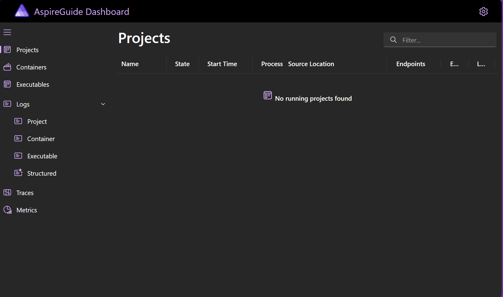

# Guide to the .NET Aspire application model

The purpose of this article is to introduce developers to fundamental concepts
in the .NET Aspire application model. These concepts include:

* Application host
* Resources
* ...

## Getting started

In this guide we will provide multiple code examples showing code from an
Aspire application host. To follow along and ensure that your development
environment is set up correctly you can create your own Aspire application
using the ```dotnet new``` command.

```dotnetcli
dotnet new aspire --name AspireGuide && cd AspireGuide
```

The previous command creates a new Aspire project that consists of a solution
and two projects:

- **AspireGuide.AppHost**; this is the main entry point to an Aspire-based application and will be the focus of this article.
- **AspireGuide.ServiceDefaults**; this is boilerplate code that can be extended by developers and reuse across mutliple services within their solution.

The `aspire` template does not include any sample code, it is a barebones
solution with just enough code to boot the local Aspire development
experience. You can start the Aspire application using the following
```dotnet run``` command.

```dotnetcli
dotnet run --project AspireGuide.AppHost/AspireGuide.AppHost.csproj
```

The output of this command should look something like this:

```
info: Aspire.Dashboard.DashboardWebApplication[0]
      Dashboard running at: http://localhost:15888/
info: Aspire.Dashboard.DashboardWebApplication[0]
      OTLP server running at: http://localhost:16031/
info: Microsoft.Hosting.Lifetime[0]
      Application started. Press Ctrl+C to shut down.
info: Microsoft.Hosting.Lifetime[0]
      Hosting environment: Development
info: Microsoft.Hosting.Lifetime[0]
      Content root path: C:\Code\AspireGuide\AspireGuide.AppHost
```

During development the Aspire application host provides a dashboard that
developers can use to diagnose problems with their application and view
telemetry that their application produces. The default dashboard URL
for Aspire is http://localhost:15888.



The previous screenshot shows the Aspire application host dashboard
with no resources defined. Resources in Aspire are parts of an application
that are typically deployed and managed together.

### Resources in the .NET Asire application model

The resources that form part of the application model are specified in the `Program.cs`
of the application host. Continuing from the previous example, here is the `Program.cs`
code listing for the application model in the AspireGuide application.

```csharp
var builder = DistributedApplication.CreateBuilder(args);

builder.Build().Run();
```

The previous listing shows the creation of a _builder_ which can be used
to configure an Aspire application. At this point the application contains
_no resources_.

## Resources types

There are three primitive resource types in a .NET Aspire application. These
are:

- **Projects**; a project represents a .NET Core project.
- **Executables**; an executable represents an arbitrary executable which Aspire launches.
- **Containers**; a containerized program specified via a `repository:tag`.

In addition to these primitive resource types, Aspire includes a number of built-in resources
for common application dependencies (e.g. Redis, Postgres, SQL Server) and can be extended
by developers and third-parties to improve productivity.

#### Adding a project to the application model

To add your own .NET project to the Aspire application model you need to reference
the project from the AppHost project. Continuing the previous example, add a new
Blazor application to the app model.

```dotnetcli
dotnet new blazor --name AspireBlazor
dotnet sln add .\AspireBlazor\AspireBlazor.csproj
dotnet add .\AspireGuide.AppHost\AspireGhide.AppHost.csproj reference .\AspireBlazor\AspireBlazor.csproj
```

In addition to adding a reference to the AppHost project you need to explcitly add
the project to the app model in `Program.cs`:

```csharp
var builder = DistributedApplication.CreateBuilder(args);
builder.AddProject<Projects.AspireBlazor>("blazorapp");

builder.Build().Run();
```

In the previous code listing the `Projects.AspireBlazor` type is a generated
type which occurs as a result of referencing the blazor project in the application
host. Each time you reference a .NET project in the AppHost a similar type
will be generated. Note that every resource in the Aspire application model has
a _stringy name_. In this case the `AspireBlazor` app has the name `blazorapp` in
the application model.

The generated type implements the `IServiceMetadata` interface which is used
as a type parameter constraint on the `AddProject<T>(...)` method. The generated
type itself captures key information necessary to help the Aspire application
host start the project.

```csharp
namespace Projects;

public class AspireBlazor : IServiceMetadata
{
  public string AssemblyName => """AspireBlazor""";
  public string AssemblyPath => """C:\Code\AspireGuide\AspireBlazor\obj\Debug\net8.0\ref\AspireBlazor.dll""";
  public string ProjectPath => """C:\Code\AspireGuide\AspireBlazor\AspireBlazor.csproj""";
}
```

In the previous code samples the `CreateBuilder(...)` method was called on the `DistributedApplication`
type. This method returns an `IDistributedApplicationBuilder` which exposes multiple methods (directly
and via extensions). The `AddProject<T>(...)` method returns another kind of builder, an
`IResourceBuilder<ProjectResource>`. This builder in turn exposes various extension methods
that allow developers to customize how the project is launched what how to connects to under resources
within the app model.

For example, the following code listing tells the application model that it should start three
replicas of the project:

```csharp
var builder = DistributedApplication.CreateBuilder(args);
builder.AddProject<Projects.AspireBlazor>("blazorapp")
       .WithReplicas(3);

builder.Build().Run();
```

When the above code is run the dashboard will show three instances of the blazor app running. Aspire
will automatically launch a reverse proxy on the local developer workstation and balance requests
between the servers (note, in this case because it is a blazor app a persistent websocket is opened).

#### Adding containers to the application model

In addition to being able to launch .NET projects within Aspire it is possible to launch pre-built
containerized applications. For example, the following code adds a wordpress container to the
Aspire application model.

```csharp
var builder = DistributedApplication.CreateBuilder(args);

builder.AddProject<Projects.AspireBlazor>("blazorapp")
       .WithReplicas(3);

builder.AddContainer("blog", "wordpress");

builder.Build().Run();
```

When this application is launched
